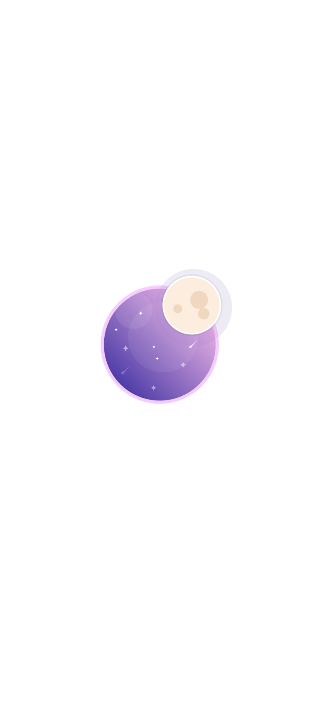
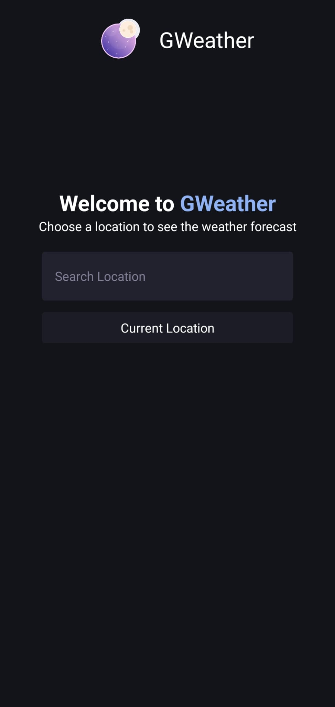
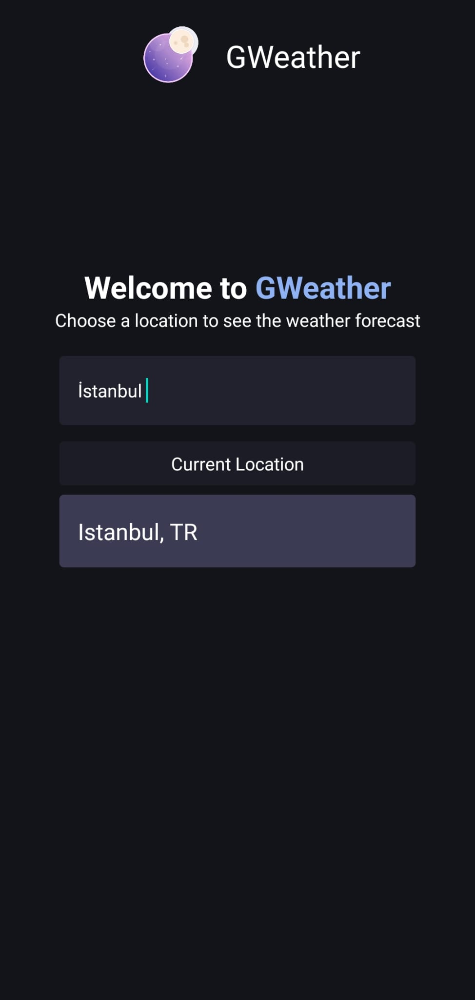
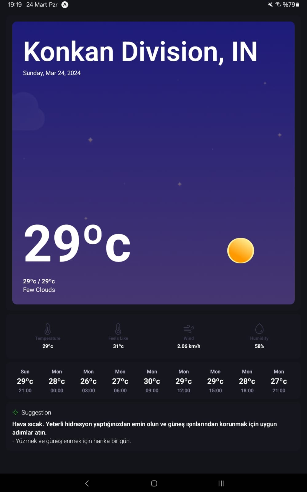
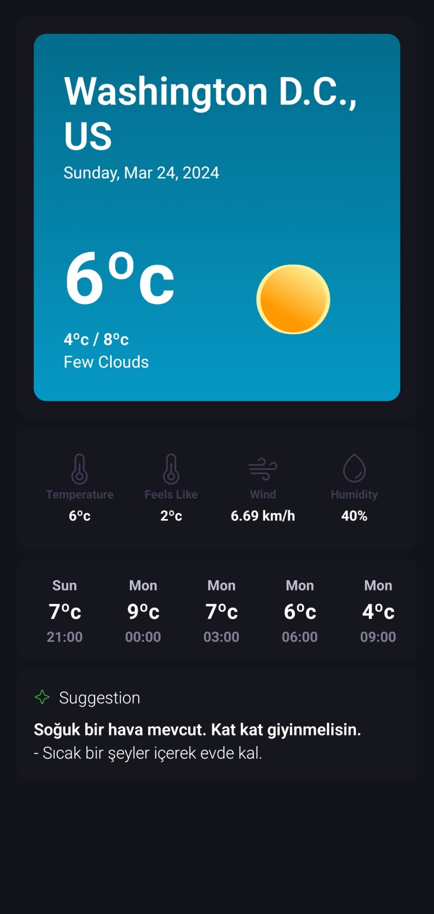

# **GWEATHER**
FullStack hava durumu uygulaması.
Bu proje React Native staj başvurusu için yapılmıştır.

## Kullanılan teknolojiler
- [React Native](https://reactnative.dev/)
- [Expo (SDK 50) App Router](https://docs.expo.dev/)
- [NativeWindCSS](https://www.nativewind.dev/quick-starts/expo)

## Proje hakkında
- Bu projenin amacı güncel hava durumu kullanıcıya göstermek ve havaya uygun tavsiyelerde bulunmaktır.
- Uygulama OpenWeatherMap API aracılığı ile güncel hava durumunu bilgilerini almakta ve yapay zeka ile oluşturulmuş tavsiyeler sunmaktadır.
- Yapay zeka tarafında daha güncel ve kullanışlı olduğundan [Google Gemini AI](https://gemini.google.com/app) tercih edilmiştir. 

## Snack
- Expo Snack, TypeScript vb. bazı kütüphaneleri çalıştırmadığı için paylaşılmamıştır. Projeyi cihazınıza kurup çalıştırmanız tavsiye edilir. 

## Kurulum
Bu proje için sisteminizde Expo CLI bulunması gerekmektedir. Detaylı bilgi [Expo CLI](https://docs.expo.dev/more/expo-cli/)
```bash
git clone https://github.com/GweepCreative/GWeather
cd GWeather
npm i
npx expo start
```
Bu aşamadan sonra proje aktif olacaktır. Terminal ekranında görünen QR kodu [Expo Go](https://expo.dev/go) uygulamasına taratarak uygulamaya giriş yapabilirsiniz.

*Faydalı olabilecek linkler*
- [Expo Go Sayfası](https://expo.dev/go) 
- [Expo Go Play Store](https://play.google.com/store/apps/details?id=host.exp.exponent&referrer=www)
- [Expo Go AppStore](https://apps.apple.com/us/app/expo-go/id982107779)

## Test Ortamları
| Cihaz        | Cihaz Tipi           | Durum  |
| ------------- |:-------------:| -----:|
| Samsung Galaxy SM-A71      | Fiziksel Android | Başarılı |
| Samsung Galaxy Tab A8 SM-X200      | Fiziksel Android | Başarılı |
| Google Pixel 6 Pro API 33      | Android Emulator      |  Başarılı |

## Uygulama içi görseller
Android 13 <br />

## Splash Screen


## Main Screen
<div>
  

</div>

## Weather Screen
<div>


</div>
  
## Sosyal Medya
- X (Twitter) - https://x.com/gweepcreative
- Mail - gweepcreative@gmail.com || info@rabelcode.net
